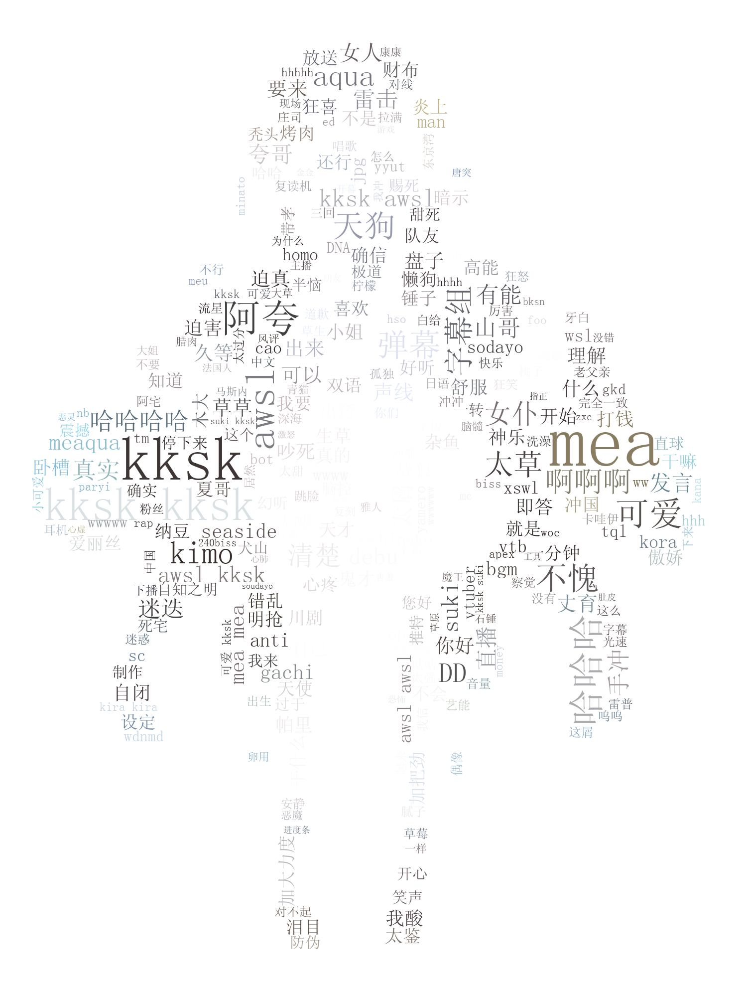

# spiderForBilibili

#### 爬取某个up主所有投稿视频中的评论信息以及弹幕信息

#### api参考自:https://github.com/Vespa314/bilibili-api/blob/master/api.md

#### 获取弹幕信息的api:https://api.bilibili.com/x/v1/dm/list.so?oid=oidxxxxxx

##### 注意 oid并不是视频的av号

> ### 新增了生成词云的脚本

#### 使用jieba分词将爬过来的弹幕数据进行处理

#### 再使用wordcloud生成词云

##### 生成中文词云需要有相对应的字体文件

